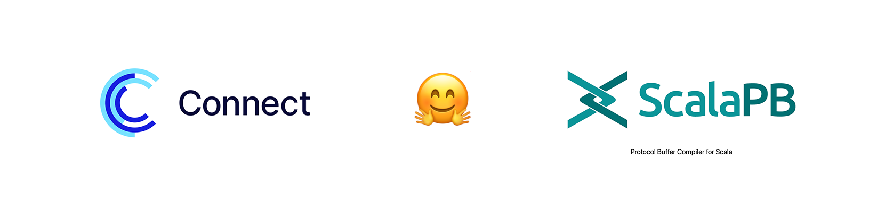

# REST API / GRPC Transcoding for GRPC services written in Scala

The library allows exposing GRPC services as REST-APIs using Connect protocol (with JSON messages) + GRPC Transcoding,
without Envoy or any other proxy.

In essence, a service implementing the following protobuf definition:

```protobuf
syntax = "proto3";

package example;

service ExampleService {
  rpc GetExample(GetExampleRequest) returns (GetExampleResponse) {}
}

message GetExampleRequest {
  string id = 1;
}

message GetExampleResponse {
  string name = 1;
}
```

Is exposed to the clients as a REST API:

```http
POST /example.ExampleService/GetExample HTTP/1.1
Content-Type: application/json

{
  "id": "123"
}

HTTP/1.1 200 OK

{
  "name": "example"
}
```

It is compatible with Connect protocol clients (e.g., generated with [Connect RPC](https://connectrpc.com) `protoc` and
`buf` plugins).

In addition, the library allows creating free-form REST APIs
using [GRPC Transcoding](https://cloud.google.com/endpoints/docs/grpc/transcoding) approach (based on `google.api.http`
annotations that can be added to methods):

```protobuf
syntax = "proto3";

package example;

import "google/api/annotations.proto";

service ExampleService {
  rpc GetExample(GetExampleRequest) returns (GetExampleResponse) {
    option (google.api.http) = {
      get: "/example/{id}"
    };
  }
}

message GetExampleRequest {
  string id = 1;
}

message GetExampleResponse {
  string name = 1;
}
```

In addition to the previous way of execution, such endpoints are exposed in a more RESTful way:

```http
GET /example/123 HTTP/1.1

HTTP/1.1 200 OK

{
  "name": "example"
}
```

---

The library works with all ScalaPB-based GRPC code-generators:

* [ScalaPB](https://scalapb.github.io) services with `Future` monad
* [fs2-grpc](https://github.com/typelevel/fs2-grpc), built on top of `cats-effect` and `fs2`
* [ZIO gRPC](https://scalapb.github.io/zio-grpc/), built on top of `ZIO`

At the moment, only unary (non-streaming) methods are supported.

## Frontends

The library provides two frontends:

* `connect-rpc-scala-http4s` — based on [http4s](https://http4s.org) server.
  More stable, was added first, but has some limitations, like inability to support streaming.
  Use `ConnectHttp4sRouteBuilder` class to build routes that then can be attached to http4s server.
* `connect-rpc-scala-netty` — based on [Netty](https://netty.io) server.
  Lower-level, not-ready-for-production *yet*, but has some advantages, making it a way to go with time:
    - Better performance
    - Support for streaming
    - Ability to reuse Netty from `grpc-netty-shaded` dependency, used by GRPC itself
    - Use `ConnectNettyServerBuilder` to build a Netty server.

Features comparison:

|                       | __http4s frontend__                 | __Netty frontend__                  |
|-----------------------|-------------------------------------|-------------------------------------|
| __Status__            | 🧡 production ready                 | alpha                               |
|                       |                                     |                                     |
| __ConnectRPC server__ | ✅                                   | ✅                                   |
| - JSON encoding       | ✅ (fully conformant)                | ✅ (fully conformant)                |
| - Protobuf encoding   | ⌛ partially /<br/> 13/85 tests pass | ⌛ partially /<br/> 12/85 tests pass |
| - Unary requests      | ✅                                   | ✅                                   |
| - Streaming requests  | ➖ / not planned                     | planned                             |
| - GET-requests        | ✅                                   | ✅                                   |
| - Compression         | identity/gzip                       | identity/gzip                       |
|                       |                                     |                                     |
| __ConnectRPC client__ | ✅                                   | planned                             |
| - JSON encoding       | ✅ (fully conformant)                |                                     |
| - Protobuf encoding   | ⌛ partially /<br/> 26/56 tests pass |                                     |
| - Unary requests      | ✅                                   |                                     |
| - Streaming requests  | ➖ / not planned                     | planned                             |
| - Compression         | identity                            |                                     |
|                       |                                     |                                     |
| __gRPC Transcoding__  | ✅ (see table below)                 | planned                             |

Built-in [GRPC Transcoding](https://cloud.google.com/endpoints/docs/grpc/transcoding) support:

|                                                                                 | __http4s server__ | __Netty server__ |
|---------------------------------------------------------------------------------|-------------------|------------------|
| __gRPC Transcoding<br/>(`google.api.http` annotations)__                        | ✅                 | planned          |
| - GET, POST, PUT, DELETE, PATCH methods                                         | ✅                 | ➖                |
| - Path parameters, e.g., `/v1/countries/{name}`                                 | ✅                 | ➖                |
| - Query parameters, repeating query parameters<br/>(e.g., `?a=1&a=2`) as arrays | ✅                 | ➖                |
| - Request body (JSON)                                                           | ✅                 | ➖                |
| - Request body field mapping, e.g. <br/>`body: "request"`, `body: "*"`          | ✅                 | ➖                |
| - Path suffixes, e.g., `/v1/{name=projects/*/locations/*}/datasets`             | ➖                 | ➖                |

## Usage


Installing http4s frontend (supports server, client) with SBT, you also need to install one of `http4s` server
implementations:

```scala
libraryDependencies ++= Seq(
  "me.ivovk" %% "connect-rpc-scala-http4s" % "<version>",
  // one of the features of http4s webserver is that you can choose between multiple
  // implementations, here we use Ember, but you can use Blaze or Jetty as well:
  "org.http4s" %% "http4s-ember-server" % "0.23.30",
  "org.http4s" %% "http4s-ember-client" % "0.23.30", // if you wish to connect to other services using Connect protocol
)
```

Netty frontend (server only, no client support yet) can be installed with SBT:

```scala
libraryDependencies ++= Seq(
  "me.ivovk" %% "connect-rpc-scala-netty" % "<version>",
)
```

### Initializing ConnectRPC server with http4s

`ConnectHttp4sRouteBuilder` is used to build routes for the http4s server.
The interface provided by the library can be expressed as:

```scala
(grpcServices: List[io.grpc.ServiceDefinition]) => org.http4s.HttpApp[F]
```

, it takes a list of GRPC services and returns a list of routes based on those services.
Then you start http4s server and pass those routes, see `.withHttpApp(httpApp)`  in the example below.
This approach allows adding additional routes, as well as using http4s middleware, like CORS, logging, etc.

Example:

```scala
import org.ivovk.connect_rpc_scala.http4s.ConnectHttp4sRouteBuilder

// Your GRPC service(s)
val grpcServices: Seq[io.grpc.ServiceDefinition] = ???

val httpServer: Resource[IO, org.http4s.server.Server] = {
  import com.comcast.ip4s.*

  for {
    // Create httpApp with Connect-RPC routes, specifying your GRPC services
    httpApp <- ConnectHttp4sRouteBuilder.forServices[IO](grpcServices).build

    // Create http server
    httpServer <- EmberServerBuilder.default[IO]
      .withHost(host"0.0.0.0")
      .withPort(port"8080")
      .withHttp2 // If you want to enable HTTP2 support
      .withHttpApp(httpApp)
      .build
  } yield httpServer
}

// Start the server
httpServer.use(_ => IO.never).unsafeRunSync()
```

### Initializing a ConnectRPC client with http4s

`ConnectHttp4sChannelBuilder` is used to create a `Channel` that can connect to other services using Connect protocol.
Channel's are low-level GRPC abstraction, which can be used to create GRPC stubs for the services.
The Channel generated by the builder will communicate with the ConnectRPC server using JSON messages.
All 3 popular Scala libraries for GRPC (`ScalaPB`, `fs2-grpc`, `zio-grpc`)
then take this Channel to create a called [stub](https://grpc.io/docs/what-is-grpc/core-concepts/#using-the-api) (e.g.
generated client).

Example:

```scala
val client: Resource[IO, ExampleServiceFs2Grpc] = {
  import org.ivovk.connect_rpc_scala.http4s.ConnectHttp4sChannelBuilder

  for {
    // You can use any http4s client implementation
    httpClient <- EmberClientBuilder.default[IO].build

    // Create a Connect RPC client channel
    channel <- ConnectHttp4sChannelBuilder[IO](httpClient)
      .build("http://localhost:8080")

    // Use the channel to create a GRPC stub for your service
    // Here we assume that fs2-grpc is used, but it can be scalapb or zio-grpc as well
    stub <- ExampleServiceFs2Grpc.stub(channel)
  } yield stub
}
```

## How-tos

How-tos that go beyond the basic usage:

* [How to support CORS-requests](docs/supporting-cors.md)
* [How to integrate with OpenTelemetry](docs/integrating-with-otel.md)
* [How to work with ZIO](docs/integrating-with-zio.md)
* [How to implement Kubernetes health checks](docs/kubernetes-health-checks.md)

## Development

### Connect RPC

#### Running Connect-RPC conformance tests

Run the following command to run Connect-RPC conformance tests:

For the Netty server:

```shell
docker build -f build/conformance/Dockerfile . --progress=plain --output "out" \
  --build-arg launcher=NettyServerLauncher --build-arg config=suite-netty.yaml
```

For the Http4s server:

```shell
docker build -f build/conformance/Dockerfile . --progress=plain --output "out" \
  --build-arg launcher=Http4sServerLauncher --build-arg config=suite-http4s.yaml
```

Execution results are output to STDOUT.
Diagnostic data from the server itself is written to the log file `out/out.log`.

### Is it production-ready?

Public APIs on the [dosh.at](https://dosh.at) website are implemented with it, you can open Web Inspector and see the
requests being made to the server (private APIs are just straight GRPC communication).

Connect RPC conformance tests are run on every commit.
The library is not a web-server or proxy, it uses `http4s` as a server implementation, and it uses official
`GRPC-inprocess` bridge to communicate with the GRPC services.
JSON ↔ Protobuf conversions are done using the `scalapb-json4s` library.

What the library does is just puts it all together, exposing HTTP routes, where it parses JSON to case classes, resolves
particular GRPC endpoint and calls it.

### Performance

Performance is not a primary goal of the library, but it is designed to be efficient.

There is no additional serialization/deserialization overhead, after JSON messages are parsed to case classes they
aren’t serialized to protobuf anymore:
GRPC bridge has some built-in optimizations to avoid unnecessary serialization-deserialization of the data.
Headers are converted between `http4s` and `grpc-java` types, but it is a very lightweight operation.

If performance is a concern, it is recommended to switch to Protobuf messages,
as it is more efficient: JSON messages are larger and slower to parse.
Protobuf messages are supported by the protocol and the library itself (it's a 1-line switch, `useBinaryFormat` option
in TypeScript client).
ScalaPB will do decoding/encoding in this case.

GRPC Transcoding is a little bit less optimal, since some additional JSON manipulations are done:

* `a.b.c` fields are converted to `a: { b: { c: ... } }` json-objects when they’re used in path and query parameters
* fields from POST-body, query and path parameters are merged into a single JSON object (I have doubts most APIs use all
  of them at once, so it is not a big deal)

Consider that normally you would use this library only once, where request lands on the server, and then you would
communicate with the internal services using GRPC.
And it should be compared with using a separate proxy (Envoy or GRPC Gateway) for the same purpose, which is one more
hop, and needs protobuf files.

#### Header Modifications

* All incoming `Connection-*` headers are removed, as they aren’t allowed by GRPC.
* All outgoing `grpc-*` headers are removed.
* Original `User-Agent` request header is renamed to `x-user-agent`,
  `user-agent` is set to the in-process client's User Agent (`grpc-java-inprocess/1.69.0`),
  there is no way to disable it.

### Thanks

The library is inspired and takes some ideas from the [grpc-json-bridge](https://github.com/avast/grpc-json-bridge).
Which doesn't seem to be supported anymore, + also the library doesn't follow a Connect-RPC standard (while being very
close to it).

## Links

* [Connect RPC website](https://connectrpc.com)
* [Connect RPC Java library](https://github.com/igor-vovk/connect-rpc-java/)
* [Connect RPC Scala library](https://github.com/igor-vovk/connect-rpc-scala)

## Other projects of the author

* [cedi](https://github.com/igor-vovk/cedi) – library for dependency injection in Scala

---

### A word about Ukraine

I'm trying to put a word about the situation in Ukraine in all projects that I'm working on.
In many areas, Ukraine right now is in a worse situation than a year ago.

Russia still attacks Ukraine, and the war is ongoing.

The russian economy worsens, but russians, if know they can win, will continue the push.

That's why it is important to show your support, to show that Ukraine is not alone.
So russians will come up with different civilization targets than rebuilding the fallen empire.

Please support Ukrainian people in any way you can, spread the word, donate to the army, donate to the humanitarian
organizations.

Official website: [war.ukraine.ua](https://war.ukraine.ua)
